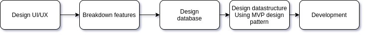
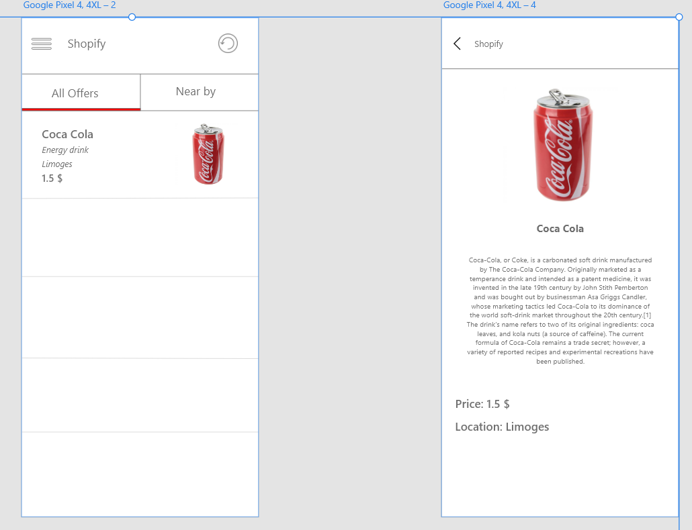
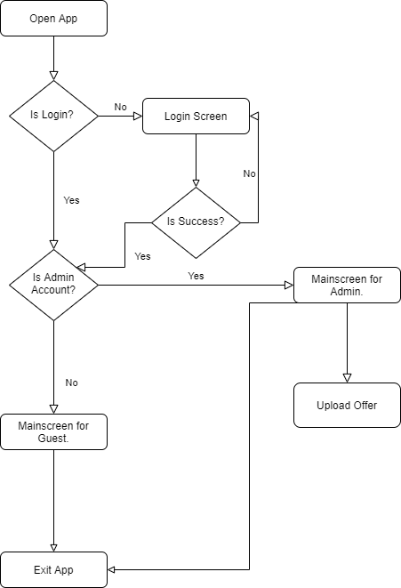
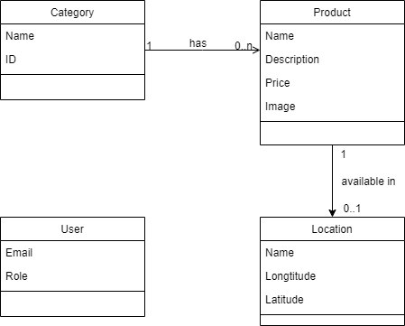

title: "Java Avanced Project - LocaLim" \newline
author: \newline \textbf{Do Duy Huy Hoang} \newline
        \textbf{Jlassi Sarra} \newline
        \newline
        \newline
        \textit{University de Limoges} \newline
date:   \today

\vspace{3cm}
\newpage{}

\listoftables
\newpage{}
\listoffigures
\newpage{}
\tableofcontents
\newpage{}

# I. Introduction 
## 1.1 Context and Motivation 
## 1.2 Objectives

Develop an E-Commerce Android application called LocaLim. Specific goals include:

- Login, logout with Firebase Authentication
- List all offers and List offers base on category
- Search offer by name
- Suggest near by offers
- Upload/Edit offer
- Preview offer:
  - Name
  - Description
  - Price
  - Image
  - Location
  - Map location
- Can swipe left-right to preview next offer

# II. Programs, Materials, Methodologies

## 2.1 Programs

### 2.1.1 Android Studio
Android Studio provides the fastest tools for building apps on every type of Android device.

### 2.1.2 Adobe XD
Adobe XD is a one-stop app, from wireframes all the way to handing off to developers.

## 2.2 Materials
### 2.2.1 Material icons

Material icons are delightful, beautifully crafted symbols for common actions and items.

## 2.3 Work flow



## 2.4 Methodologies

### Design UI/UX

We draft our application design by using Adobe XD which is a free and easy to use software.
The application will have 6 main screens which is:
- Splash screen
- Login screen
- List offer screen ( all offers, by category, nearby )
- Detail offer screen
- Upload offer screen
- Search offer screen



By following this design, it is way better and easier to build the application later.
Also, Adobe XD provides us the fastest method for creating interactive prototypes after we have completed our screens.
So that we can visualize how users can experience your app or website by building an interactive prototype.

### Breakdown features

Regarding each above function, we designed the data structure intending to the most convenient way to read and write objects on Firebase while executing the source code.
Also we need to ensure that the bussiness logic is built carefully and met the requirement correctly.

### Database

We use *Realtime Database* and also *Storage* feature from `Firebase`.
The database will have two collections: `Product` and `User`.
The `Product` collection has category object for example: drink, food, clothes, etc. And inside these category, it is including detail offers which is represented as below:

```
offer_id:
	description: "short description"
	id: offer_id
	image: "offer image"
	location:
		latitude
		longtitude
		name
	name: "offer name"
	price
```

The `User` collection only contain user information and their *role* (admin, normal user).


### Data structure

#### MVP design pattern 

A clean codebase is always a pleasure to work with. A well organized codebase is easy to maintain, is robust, performs well, is testable and is self-documenting. In order to do that, the application will be written by using MVP - short for Model-View-Presenter design pattern.

For all the activity in this application will have:

- `Model class`: including the data from Firebase
- `View`: Activity, Fragment, Interface View
- `Presenter`: Interface Presenter

MVP model works according to the rule: all code handling bussiness logic is in `Presenter`. After the result, `Presenter` will ask `View` to display with corresponding result.


### Development

In this section, we firstly discuss our special approach to do the layout for UI. After that, we will explain all the methods of the work.

#### Flow chart

Describe the flow of the entire application. The user start application then it checks to see if logged in or not, then switch to the login screen so that the user can login, if so or log in successfully then check if the login account is a guest or admin role that displays the screen corresponding to each role. If it is admin, you can upload and edit more products.

{ width=80% }

#### Class diagram

A Category can have 0 or more products. A product is available in a certain location or is not currently available.

{ width=100% }

#### Layout

#### Login activity

- `View`: `ILoginView` Define actions on the view to be controlled by Presenter (*showLoading, hideLoading, onSuccess, onFailure, goToMainScreen*). `LoginActivity` will implement the above interface to define the functions in detail.
- `Presenter`: Will hold the View preference to be able to control the View when there is a result through the new ILoginPresenterImpl (this) constructor. In LoginActivity, if Login is a logical bussiness, let the presenter handle the parameters of email and password from edit text on UI via presenter.login function (email, password). At `Presenter`, when the login function is called, it will call authentication to Firebase if successful, it will perform co-action on the UI via the view.onSuccess () function, otherwise, call view.onFailure ().


