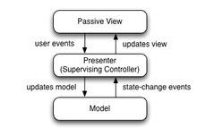

\vspace{3cm}
\pagenumbering{Roman} 
\newpage{}
\listoffigures
\newpage{}
\tableofcontents
\newpage{}
\pagenumbering{arabic} 

# I. Introduction 

The application that we had developed is a E-commerce application. The goals of this project is to carry out an application that provides users with a description of the products and their locations by using map localization . Moreover the application enables the users to upload and edit their own offers .

## Contributor

This application was divided into many tasks and issues and have been done almost the functions in the same computer by:

- DO Duy Huy Hoang
- JLASSI Sarra

## Objectives

Develop an E-Commerce Android application called LocaLim. Specific goals include:

- Login, logout with Firebase Authentication
- List all offers and List offers base on category
- Search offer by name
- Suggest near by offers
- Upload/Edit offer
- Preview offer:
  - Name
  - Description
  - Price
  - Image
  - Location
  - Map location
- Can swipe left-right to preview next offer

# II. Programs, Materials, Methodologies

## 2.1 Programs

### 2.1.1 IntelliJ 

IntelliJ provides the fastest tools for building apps on every type of Android device.

### 2.1.2 Adobe XD

Adobe XD is a one-stop app, from wireframes all the way to handing off to developers.

## 2.2 Materials
### 2.2.1 Material icons

Material icons are delightful, beautifully crafted symbols for common actions and items.

## 2.3 Work flow


## 2.4 Methodologies

### Design UI/UX

We draft our application design by using Adobe XD which is a free and easy to use software.
The application will have 6 main screens which is:
- Splash screen
- Login screen
- List offer screen ( all offers, by category, nearby )
- Detail offer screen
- Upload offer screen
- Search offer screen


By following this design, it is way better and easier to build the application later.
Also, Adobe XD provides us the fastest method for creating interactive prototypes after we have completed our screens.
So that we can visualize how users can experience your app or website by building an interactive prototype.

### Breakdown features

Regarding each above function, we designed the data structure intending to the most convenient way to read and write objects on Firebase while executing the source code.
Also we need to ensure that the bussiness logic is built carefully and met the requirement correctly.

### Database

We use *Realtime Database* and also *Storage* feature from `Firebase`.
The database will have two collections: `Product` and `User`.
The `Product` collection has category object for example: drink, food, clothes, etc. And inside these category, it is including detail offers which is represented as below:

\newpage{}

```
offer_id:
	description: "short description"
	id: offer_id
	image: "offer image"
	location:
		latitude
		longtitude
		name
	name: "offer name"
	price
```

The `User` collection only contain user information and their *role* (admin, normal user).


### Data structure

#### MVP design pattern 

A clean codebase is always a pleasure to work with. A well organized codebase is easy to maintain, is robust, performs well, is testable and is self-documenting. In order to do that, the application will be written by using MVP - short for Model-View-Presenter design pattern.

For all the activity in this application will have:

- `Model class`: including the data from Firebase
- `View`: Activity, Fragment, Interface View
- `Presenter`: Interface Presenter

MVP model works according to the rule: all code handling bussiness logic is in `Presenter`. After the result, `Presenter` will ask `View` to display with corresponding result.



### Development

In this section, we firstly discuss our special approach to do the layout for UI. After that, we will explain all the methods of the work.

#### Use cases 

Use cases diagram

{ width=60% }

#### Flow chart

Describe the flow of the entire application. The user start application then it checks to see if logged in or not, then switch to the login screen so that the user can login, if so or log in successfully then check if the login account is a guest or admin role that displays the screen corresponding to each role. If it is admin, you can upload and edit more products.

{ width=70% }

\newpage{}

#### Class diagram

A Category can have 0 or more products. A product is available in a certain location or is not currently available.

{ width=100% }
- Add Register function

#### Login activity

- `View`: `ILoginView` Define actions on the view to be controlled by Presenter (*showLoading, hideLoading, onSuccess, onFailure, goToMainScreen*). `LoginActivity` will implement the above interface to define the functions in detail.
- `Presenter`: Will hold the View preference to be able to control the View when there is a result through the new ILoginPresenterImpl (this) constructor. In LoginActivity, if Login is a logical bussiness, let the presenter handle the parameters of email and password from edit text on UI via presenter.login function (email, password). At `Presenter`, when the login function is called, it will call authentication to Firebase if successful, it will perform co-action on the UI via the view.onSuccess () function, otherwise, call view.onFailure ().

#### All product Fragment

- View: IProductView has functions for Presenter to interact with view (onSuccessListOffer, onSuccessCategory, onSuccessListByCategory, onFailure)
- When creating Fragment, View requires presenter get all products from Firebase Database then separate to create category list and product list. Send these 2 lists to View via function onSuccessCategory and onSuccessListOffer. In View 2 this list is saved as cache at MainApplication.
- When the user changes the filter option, the View asks the presenter to get the product according to the selected category. If successful, return the list of products by category to View via onSuccessListByCategory function, otherwise, onFailure.

#### Nearby

Once created, it will get the Offer global list at MAinApplication to filter the products with the coordinates matching the current location of the user.

#### Upload activity

- View: IUploadView specifies operations on the view (showLoading, hideLoading, onUploadImageSuccess, onUploadProductSuccess, onFailure) for Presenter to control.
- Presenter: Hold the View preference to update UI when it comes up. If you want to upload a product, the user will fill in the necessary information of a product, select an image from the gallery or take a photo and also the product's location, then ask Presenter Upload Image if Presenter returns onUploadImageSuccess, View continues to Product upload request with image link has just been returned. If the product upload is successful, the Presenter will return onSuccess otherwise onFailure.

#### Edit 

Similar to Upload, the View will receive the Detail of an offer to fill in the fields, the user will update the information as well as the photo and location of the location. When you press Upload, View asks PResenter to upload the image to Firebase Storage if successful, return the image link to the View via the ponUploadImageSuccess function, the View continues to ask Presenter to update the product with new information and attached image link. Public, then send mesage to Vipew via onUpdateSuccess function, otherwise onFailure

#### DetailOffer activity

- `View`: `IProductView` Define actions on the view to be controlled by IProductPresenter. DetailOffer Activity will implement the above interface to define the functions
in detail.
- `Presenter`: Will hold the View preference to be able to control the View
when there is a result through the new IProductPresenterImpl (this) con-
structor. At Presenter, when the getProduct function is called, it will call the products inserted in the Firebase if successful, it will perform co-action on the UI via the view.onSuccess () function, otherwise, call view.onFailure ().

#### Search activity

- View: ISearchView Define actions on the view to be controlled by ISearchPresenter(onSuccessSearch,onFailure).
Search Activity will implement the above interface to define the functions
in detail.
- Presenter: Will hold the View preference to be able to control the View when there is a result through the new ISearchPresenterImpl (this) constructor. At Presenter, when the onSuccessSearch function is called, it will call search the products inserted in the Firebase if successful, it will perform co-action on the UI via the view.onSuccess () function, otherwise, call view.onFailure ().

# Result and Discussion

## Application result


\newpage{}

Usage

- For authentication: 
  - Admin account: 
    - email: def@gmail.com 
    - password: 123123
  - Normal account:
    - email: abc@gmail.com
    - password: 123123

# Conclusion and Future work

## Conclusion

In this project, we have fulfilled the standard requirements set out from the beginning in a short amount of time. We have presented the details of the implementation and also our special features

## Future work

- Add Register function
  - Create unique ID for user
  - Specify user role
  - User can edit their own offer
  - Add user detail information activity
- Refractor code
- Data constrains
- Refractor account collection firebase
- Improve UI/UX

# References

1. Authenticate with firebase using password-based accounts on android, https://firebase.google.com/docs/
auth/android/password-auth
2. Class observables, http://reactivex.io/RxJava/javadoc/io/reactivex/Observable.html
3. Create a list with recyclerview, https://developer.android.com/guide/topics/ui/layout/recyclerview
4. Custom view components, https://developer.android.com/guide/topics/ui/custom-components
5. Framelayout, https://developer.android.com/reference/android/widget/FrameLayout
6. Swipe function: [Created by amitshekhar](https://blog.mindorks.com/android-tinder-swipe-view-example-3eca9b0d4794)